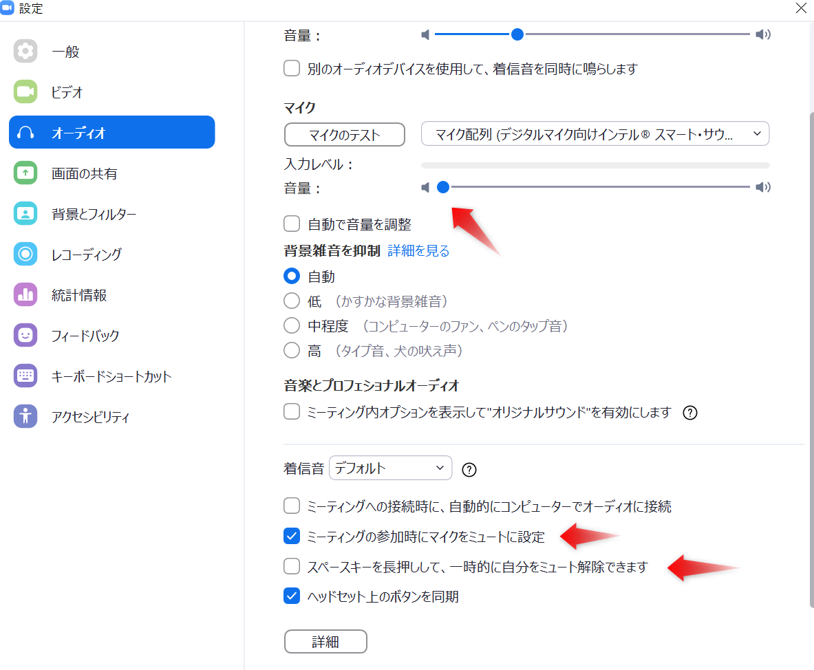
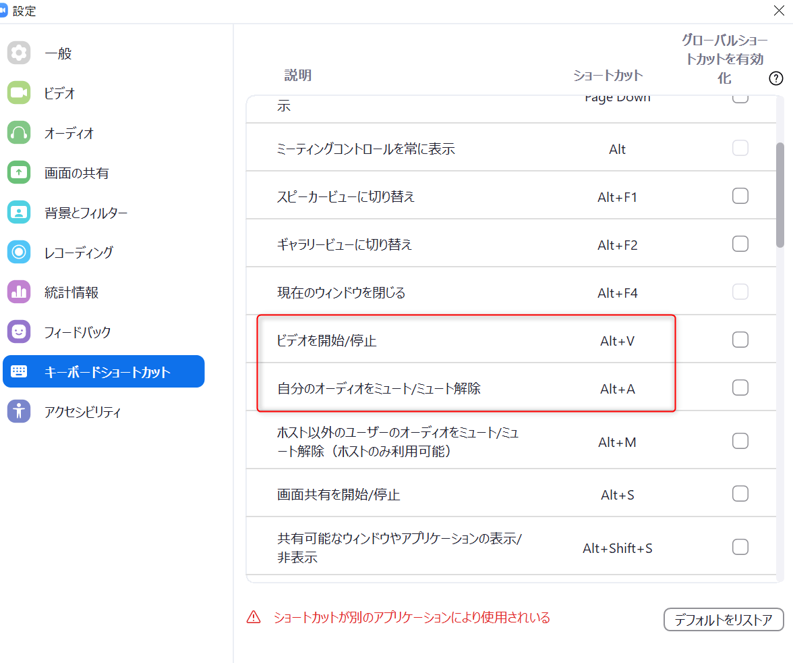
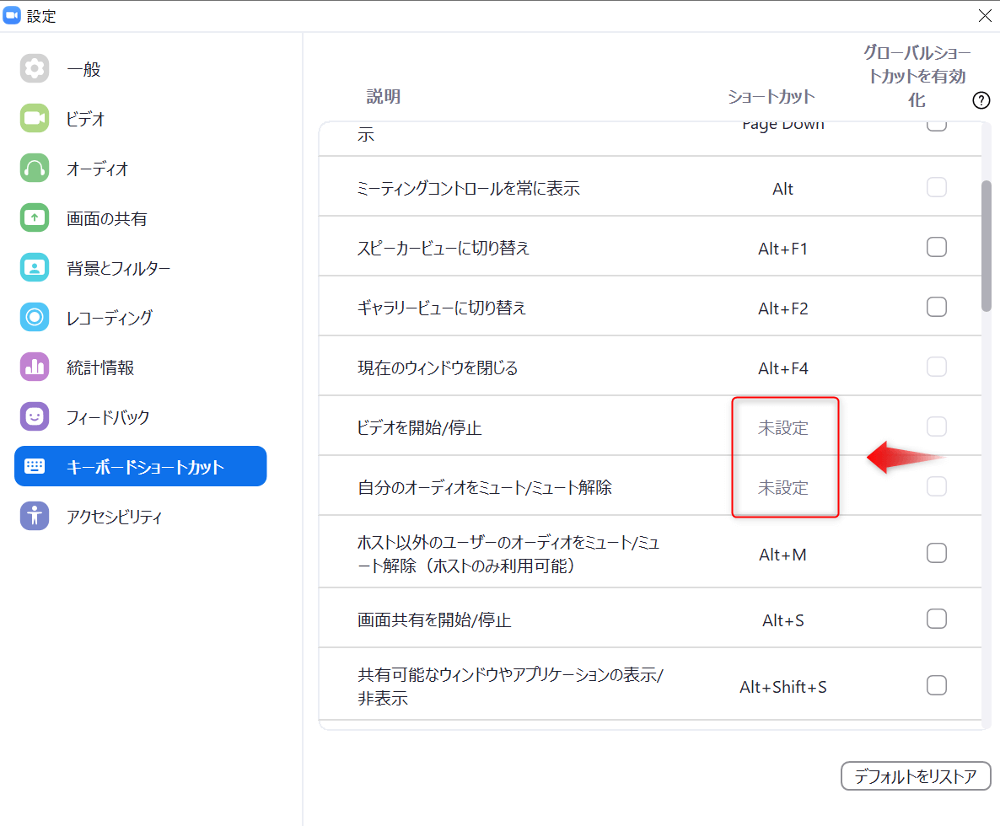

Zoomでの授業や会議で誤爆しないためにチェックしておくべき設定項目のまとめ。

## オーディオ設定

「ミーティングの参加時にマイクをミュートに設定」にチェックを入れておくと、入室時にあわててミュートせずに済みます。

マイクでしゃべる機会が少ない場合は、入力レベルを最小にしておいて、必要に応じて音量を調節するのもいいと思います。

スペースキーを押している間ミュートを解除するのも無効にしておくと安心。

## ショートカットキーの設定

独り言が多いと自覚のある人は確認してください。

「ビデオ開始/停止」にはAlt + V、「自分のオーディオをミュート/ミュート解除」にはAlt +  Aがデフォルトで割り当てられていますが、未設定にしておきます。

## ブレイクアウトルーム終了時の注意

ブレイクアウトルームで発言をするためにミュートを解除したあと、全体のルームに戻ったとき、音声は自動でミュートになりません。

**ブレイクアウトルーム終了時には必ずミュートにする**ことを心がけてください。