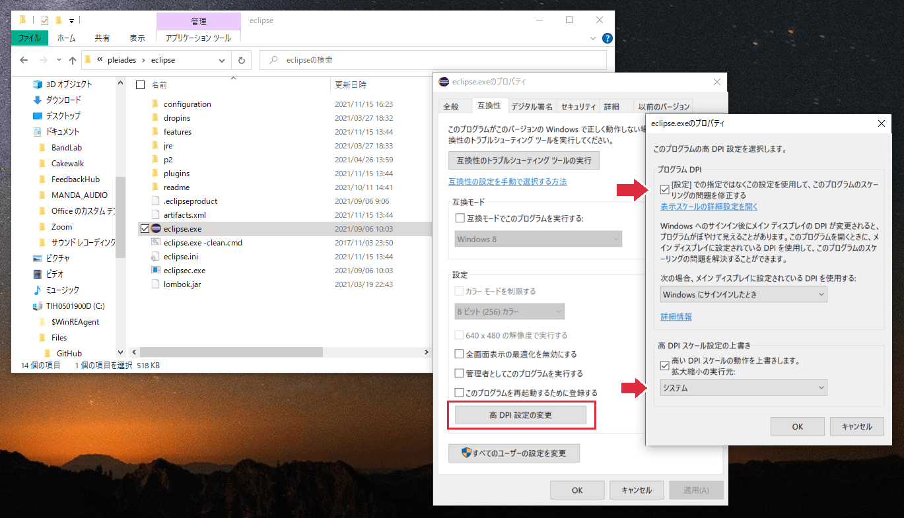
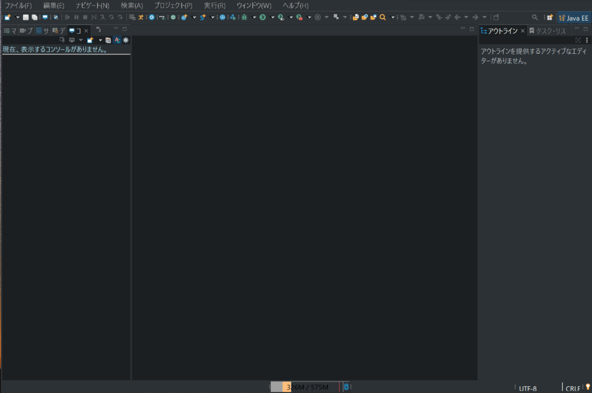
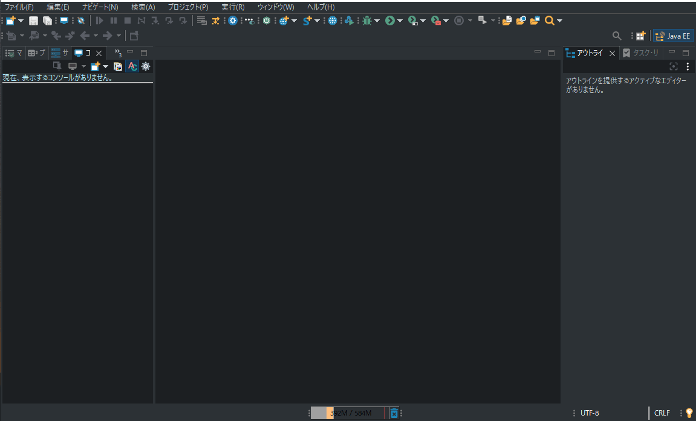

前回の更新から5ヶ月以上...もはや自分のブログの存在すら忘れていた...年末にかけて再始動していきたい。

今回はEclipseの話で、Eclipseは高解像度の画面に最適化されておらず、デフォルトの状態だと上部のボタンまわりのUIが小さく表示されます。今日では4Kディスプレイも普及しているので、フルHD(1920*1080)はもはや高解像度には分類されないと思いますが、フルHDでもかなり小さく感じます。

解決方法にはレジストリを修正してマニフェストファイルを修正するなどいろんなあるみたいですが、高DPIスケール設定が一番簡単そうだったのでそのメモ。

## 手順

1. Eclipseのインストールフォルダからeclipse.exeを探して右クリック→プロパティ
2. 互換性タブ → 高DPI設定の変更
3. [設定]での指定ではなくこの設定を使用して、このプログラムのスケーリングの問題を修正する にチェック
4. 高DPIスケール設定の上書きにチェック → システムを選択

## 画面の比較

### 設定前

全体的にアイコンが小さすぎてよく見えない。

### 設定後

上部のボタンやフォントサイズが大きくなりました。なお、アイコンは少しぼやける感じになるのでそこはトレードオフになりますね。

## 参考

- [Windows 10でEclipseのHiDPI対策 - M12i.](https://m12i.hatenablog.com/entry/2016/04/20/085833)
- [Eclipseの文字とかアイコンがちっちゃい - Qiita](https://qiita.com/shirohanada/items/96ae4a7b05f4675106e4)
