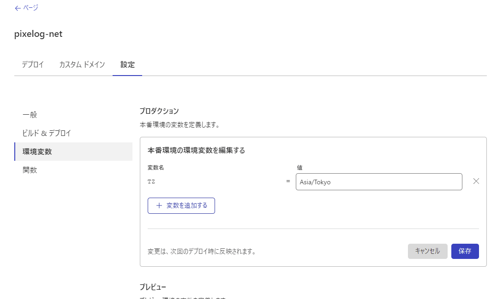

当ブログのホスティング先をGitHub PagesからCloudflare Pagesへ移行して、記事のパーマリンクを乱数ベースから日付時刻ベースへ変更したのですが、ローカル環境とCloudflareのタイムゾーンが違うせいでURLがずれてしまうので、Cloudflare Pagesのタイムゾーンを日本に変更します。

## 環境変数の追加

1. ダッシュボード>Pages>任意のプロジェクト>設定>環境変数
2. 変数を編集する>変数名に`TZ`、値に`Asia/Tokyo`を入力
3. 保存

同じく静的サイトジェネレーター等を使っている方はお試しください。
