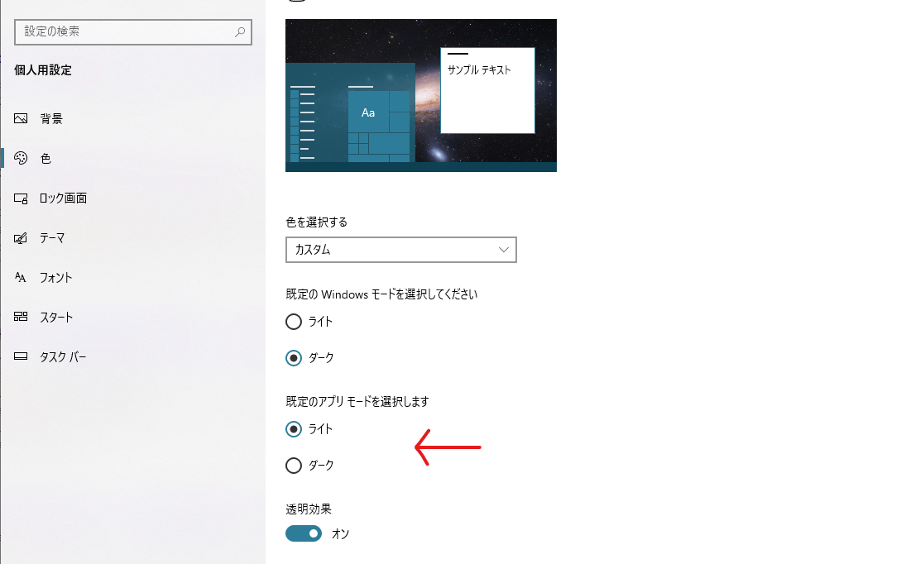

Windows10はシステムレベルでのダークモードに対応していますが、
- 設定>個人用設定>色>カスタム>既定のアプリモードを選択します>ダーク

と、設定項目が階層の深いところにあり、切り替えが大変なので、AutoHotkeyでショートカットキーひとつでダークモードへ切り替えられるようにします。


## スクリプト




設定画面で「色を選択する」をカスタムにしたときに現れる、アプリモードの色を、レジストリから直接ダークに設定します。Windowsモードは触りません。

Windowsモードはタスクバーやスタートメニューに反映され、エクスプローラーなどはアプリモードを参照しているようです。よくあるスマホに実装されているダークモード機能でWindows10に相当するのは、アプリモードの方だと思われます。


ホットキーラベルは`Win+F1`に割り当てていますが、お好みにあわせて変更してください。

```ahk
; ダークモード切り替え Win+F1
#F1::
	RegRead,isLightMode,HKCU,SOFTWARE\Microsoft\Windows\CurrentVersion\Themes\Personalize,AppsUseLightTheme
	
	If isLightMode {
		RegWrite,Reg_Dword,HKCU,SOFTWARE\Microsoft\Windows\CurrentVersion\Themes\Personalize,AppsUseLightTheme,0
	} Else{ 	
		RegWrite,Reg_Dword,HKCU,SOFTWARE\Microsoft\Windows\CurrentVersion\Themes\Personalize,AppsUseLightTheme,1
	}
	run,RUNDLL32.EXE USER32.DLL`, UpdatePerUserSystemParameters `,2 `,True
	Return
```

`Win+F1`でダークモードへ切り替え、もう一度押せばライトモードへ戻ります。