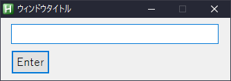

AutoHotkeyのGUIでSubmitボタンを隠す方法。


## テキストフィールドとボタン



```ahk
F1::
    Gui, Font, S12, Yu Gothic
    Gui, Add, Edit, w300 vhoge
    Gui, Add, Button, Default, Enter
    Gui, Show, Center w332, ウィンドウタイトル
    Gui, +AlwaysOnTop
    Return
    ButtonEnter:
        Gui, Submit
        ; Enterを押したときの処理
        TrayTip, 通知タイトル, %hoge%  
    GuiEscape:
    GuiClose:
        Gui, Destroy
```

テキストフィールドに入力した文字列が、そのままWindowsのトースト通知で返ってきます。

ButtonのオプションにDefaultが設定されているので、テキストフィールド内でEnterを押下するとボタンが押されたことになり、ButtonEnterラベルが処理されます。


## テキストフィールドのみ


```ahk
F1::
    Gui, Font, S12, Yu Gothic
    Gui, Add, Edit, w300 vhoge
    Gui, Add, Button, x0 y0 w0 h0 hidden Default, Enter
    Gui, Show, Center w332, ウィンドウタイトル
    Gui, +AlwaysOnTop
    Return
    ButtonEnter:
        Gui, Submit
        ; Enterを押したときの処理
        TrayTip, 通知タイトル, %hoge%  
    GuiEscape:
    GuiClose:
        Gui, Destroy
```

Enterで確定できるならそもそもボタンは不要なので、ボタンを力技で消します。

オプションで`hidden`を指定することでボタンを隠れます。さらに`x0 y0 w0 h0`でサイズを0にし絶対配置することで、ボタンがあったスペースも消えます。おしまい！


## 参考

- [GUIのコマンド | AutoHotKey](https://so-zou.jp/software/tool/system/auto-hot-key/commands/gui.htm)
- [Gui: create fully hidden submit button (no space allocation) - Ask for Help - AutoHotkey Community](https://www.autohotkey.com/board/topic/76949-gui-create-fully-hidden-submit-button-no-space-allocation/)
